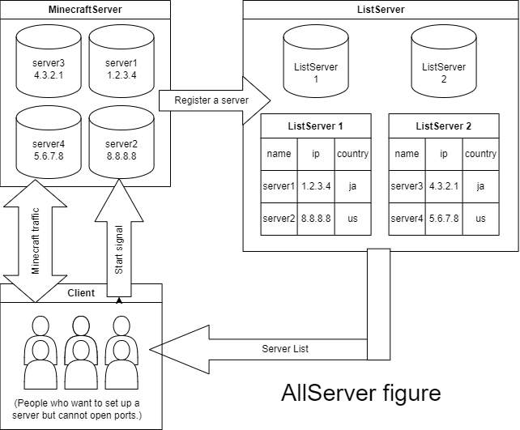

# AllServer
## 概要
AllServerは、非常に低コスト・低負荷で動くマインクラフトサーバー提供システムです。

ポート開放ができない人でも無料でサーバーを立てられます

一つのサーバーに集中して、マインクラフトサーバーを動かすのではなく、たくさんのサーバ提供者にランダムにマインクラフトサーバーを立てるシステムです。

サーバーは、サーバーの一覧を持っているサーバー と マインクラフトサーバーを立てれるサーバーの二種類に分かれます

図


## メリット・デメリット
### メリット
- 低負荷であるため、パソコンで作業している間でも裏で支援できる
- 一つのサーバー提供者に頼らないため、無料でサーバーを立てれる
### デメリット
- 支援者によってサーバーの快適差が変わる可能性がある
- 支援者よりも利用者が多い場合は立てられない可能性がある
## 必要環境
- OS Linux/Windows/OS X
- Java(Minecraft バージョンに合っている)
- Python3(最新バージョン推奨)
Requests(ライブラリ)

## インストール方法
1. pipでライブラリをインストールする。
もし、pipが入ってない場合はapt(ubuntu)などで入れてください。
```
pip install requests
```
2. インストール先が正しくパーミッション・所有者が設定されていることを確認してください。<br/>
Linux : `ls -l`<br/>
Windows : `dir /q`
3. <a href="https://github.com/stsaria/allserver/archive/refs/heads/main.zip">ダウンロード</a>からソースコードをダウンロードします。
4. allserver.pyを起動します<br/>
('--help'引数を使えばヘルプが出ます)
```
python3 allserver.py

AllServer

モードを選択してください。

[1] : クライアントモード（サーバー作成・検索）
[2] : マインクラフトサーバーモード（サーバー支援・ リストに登録）
[3] : リストサーバーモード（マインクラフトサーバー リスト）
[4] : 終了
[1,2,3,4] :
```
## クライアントの使い方
### サーバーの検索
1. allserver.pyを起動
2. クライアントモードを選択
3. サーバー検索モードを選択
4. リストサーバーIPを入力
```
python3 -u allserver.py
AllServer

モードを選択してください。

[1] : クライアントモード（サーバー作成・検索）
[2] : マインクラフトサーバーモード（サーバー支援・リストに登録）
[3] : リストサーバーモード（マインクラフトサーバーリスト）
[4] : 終了
[1,2,3,4] :1

クライアントモードを選択してください。
※マインクラフト'JAVA'版がインストールされている場合のみサーバーを作成してください！

[1] : サーバー検索
[2] : サーバー起動（自動）
[3] : サーバー起動（手動）
[4] : 戻る
[1,2,3,4] :1
リストサーバーIPを入力してください :サーバーIP
成功しました
合計数 : 1

名前:host IP:サーバーIP 言語(国名):ja チーム:everyone/Everyone 追記:message
```
### サーバーの立て方
1. allserver.pyを起動
2. サーバー起動モードを選択<br/>
マインクラフトサーバーのサーバーアドレスを知らない場合は、**自動**を選ぶ（※リストサーバーのアドレスを知っている必要があります。）<br/>
マインクラフトサーバーのアドレスを既に知っている場合は、**手動**を選ぶ
4. サーバーIPを入力
5. Motdを入力
6. OP権限を与えるMCIDを入力('/stop'コマンドを扱えるユーザーにしましょう)
7. 表示されたマインクラフトサーバーバージョン・IPで接続
8. 終了する際は、'/stop'コマンドを実行すればサーバーが停止します(1時間立つと自動的にサーバーが停止します)
```
python3 -u allserver.py
AllServer

モードを選択してください。

[1] : クライアントモード（サーバー作成・検索）
[2] : マインクラフトサーバーモード（サーバー支援・リストに登録）
[3] : リストサーバーモード（マインクラフトサーバーリスト）
[4] : 終了
[1,2,3,4] :1

クライアントモードを選択してください。
※マインクラフト'JAVA'版がインストールされている場合のみサーバーを作成してください！

[1] : サーバー検索
[2] : サーバー起動（自動）
[3] : サーバー起動（手動）
[4] : 戻る
[1,2,3,4] :2 または 3
リスト・マインクラフトサーバーIPを入力してください :サーバーIP
サーバーMotdを入力してください :motd
あなたのMCIDを入力してください(UUIDではありません)(このMCIDにOP権限を与えます) :mcid

サーバーの起動をお待ちください

※Ctrl+Cでサーバーは止められません！
サーバーを止める際はマインクラフトサーバー上で'/stop'コマンドを使用してください
ただし、一時間でサーバーは自動的に閉じます
ですが、その方法は非常に迷惑をかける可能性がありま すので、できるだけ避けてください
サーバーのポートが開いていることを確認しています .OK

サーバーバージョン : version
サーバーポート : 25565

ServerIP : サーバーIP
正常終了しました
```
## サーバーの使い方
### マインクラフトサーバー
#### 特別必要要件
- ポート**50385**の開放
- メモリ容量2GB以上(推奨4GB以上)
#### サーバーをリストサーバーに登録
1. allserver.pyを起動
2. マインクラフトサーバーモードを選択
3. サーバー登録モードを選択
4. リストサーバーのIPを入力
5. サーバー名、補足を入力
```
python3 -u allserver.py
AllServer

モードを選択してください。

[1] : クライアントモード（サーバー作成・検索）
[2] : マインクラフトサーバーモード（サーバー支援・リストに登録）
[3] : リストサーバーモード（マイクラサーバーリスト）
[4] : 終了
[1,2,3,4] :2
マインクラフトサーバーモードを選択してください。

[1] : サーバー起動
[2] : サーバー登録(リストサーバー)
[3] : 戻る
[1,2,3] :2
サーバーIPを入力してください :サーバーIP
サーバー名を入力してください :マインクラフト1
補足を入力してください :message
成功しました
```
#### サーバー起動
1. allserver.pyを起動
2. マインクラフトサーバーモードを選択
3. サーバー起動モードを選択
```
python3 -u allserver.py   
AllServer

モードを選択してください。

[1] : クライアントモード（サーバー作成・検索）
[2] : マインクラフトサーバーモード（サーバー支援・リストに登録）
[3] : リストサーバーモード（マインクラフトサーバーリスト）
[4] : 終了
[1,2,3,4] :2
マインクラフトサーバーモードを選択してください。

[1] : サーバー起動
[2] : サーバー登録(リストサーバー)
[3] : 戻る
[1,2,3] :1
yyyy-mm-dd hh:mm:ss,fff@ Start Server
CtrlとCを押せば終了します
```
引数で起動する場合(Systemd・スタートアップ等)は`--start-minecraft-server`引数をallserver.pyの後につけて起動する
```
python3 -u allserver.py --start-minecraft-server
AllServer

yyyy-mm-dd hh:mm:ss,fff@ Start Server
CtrlとCを押せば終了します
```
### リストサーバー
#### 特別必要要件
- ポート**50384**の開放
前提として、ポート50384をクライアントからアクセスできるようにしてください。
#### サーバー起動
1. allserver.pyを起動
2. リストサーバーモードを選択
3. サーバー起動モードを選択<br/>
※初回起動時には説明が出ます
```
python3 -u allserver.py
AllServer

モードを選択してください。

[1] : クライアントモード（サーバー作成・検索）
[2] : マインクラフトサーバーモード（サーバー支援・リストに登録）
[3] : リストサーバーモード（マインクラフトサーバーリスト）
[4] : 終了
[1,2,3,4] :3
あなたはこのリストサーバーを立てるのは初めてですか？
注意事項があります。
・ローカル内以外に公開する場合はTCPポート 50384 をルーターなどで開放してください。
・logフォルダーのlistserver.logにIP情報を含むログが記録されています。
もし常識的なアクセス数を超える場合(いわいる、'DOS'というもの)は、IPをブロックするといいでしょう。

作成しますか？
[1] : 作成する
[2] : 戻る
[1,2] :1
yyyy-mm-dd hh:mm:ss,fff@ Start Server
CtrlとCを押せば終了します
```
引数で起動する場合(Systemd・スタートアップ等)は`--start-list-server`引数をallserver.pyの後につけて起動する
```
python3 -u allserver.py --start-list-server
AllServer

yyyy-mm-dd hh:mm:ss,fff@ Start Server
CtrlとCを押せば終了します
```
